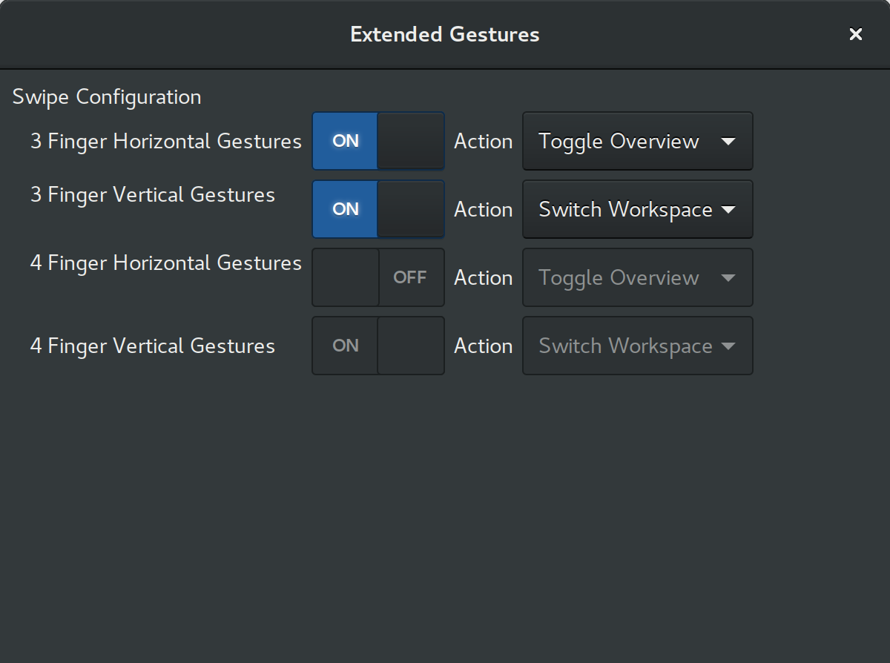

# gnome-shell-extended-gestures

Provides extended touchpad gesture functionality and configuration to the GNOME desktop.



## Background

By defualt, GNOME uses `libinput` to detect touchpad gestures as they are performed by the user. However, it is still fresh and the only gesture detected and acted on out of the box is four finger vertical swipes. When it sees this gesture, it switches workspaces for the user, much like macOS is famous for doing by default. I recently found [libinput-gestures](https://github.com/bulletmark/libinput-gestures) which allows you configure other gestures seen by `libinput`. There are some quirks though and I thought I could make something that works more integrated with GNOME. So I made this extension which lets you enable and configure other gestures such as three finger swipes.

## What Does It Allow Me To Do

For now, it allows the user the configure three finger horizontal and vertical gestures to perform a choice of actions supplied through the extension settings in `gnome-tweak-tool`. It should work on most modern laptops with multitouch trackpads. It has been tested on a `Macbook Pro Retina 11,1` and a `Surface Pro 3`.

## Current Limitations

Currently there are a few limitations so far that you should be aware of: 

* Actions are currently limited to things baked into the GNOME shell because this extension is basically sandboxed there. So currenlty setting an action like "swipe to go forward or back in the browser" is not currently possible. 
* Pinch gestures are not handled or configured. Eventually I want to add in support for all pinching gestures but I have not done so yet. See issue #3.
* Four finger swipe gestures are captured by defualt by GNOME shell so they can not be handled by this extension. However, eventually four finger pinches should be able to be handled I believe. 
* It only works with GNOME Wayland 3.24. See the releases for a working 3.22 version.
* It should work any distro that used GNOME Wayland 3.24 and `libinput`. Confirmed working with Arch Linux and Ubuntu GNOME 17.04
* It *only* handles touchpad gestures, not touchscreen gestures because those are much better supported in GNOME out of the box.

## Requirements

* GNOME 3.24
* Wayland
* libinput

## Installation

I have not uploaded this extension to the store yet, so for now you will have to install manually in either of two ways:

1. Clone the repo a in your `~/.local/share/gnome-shell/extensions` folder like so. Then log out and back in to your session and you should be able to enable the extension in Tweak Tool

	```bash
	git clone https://github.com/mpiannucci/gnome-shell-extended-gestures
	cp -r gnome-shell-extended-gestures/extendedgestures@mpiannucci.github.com ~/.local/share/gnome-shell/extensions
	```

2. Clone or download the repo where ever you would like, zip it up and install it manually through Tweak Tool

	```bash
	git clone https://github.com/mpiannucci/gnome-shell-extended-gestures
	cd gnome-shell-extended-gestures
	zip -r extendedgestures@mpiannucci.github.com.zip extendedgestures@mpiannucci.github.com
	```

## License

[GPL V3](LICENSE)
